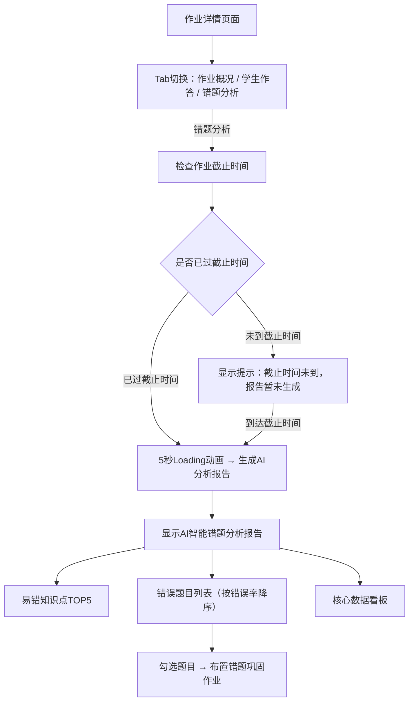
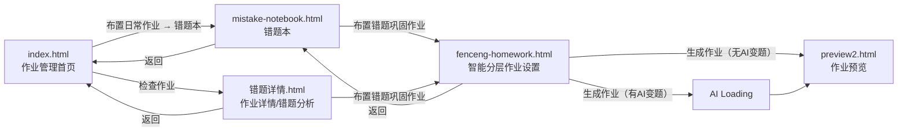

# 错题巩固作业功能 — 需求说明文档

> 版本：v1.0  
> 日期：2026-02-27  
> 产品：Sigma Education（兆涵科技智慧教育平台）

---

## 一、功能概述

本功能为教师端"错题巩固作业"模块，教师可基于学生历史作业中的错题数据，筛选错题、分析错因、并智能布置巩固作业。系统支持智能分层（根据学生知识点掌握程度自动分层）和非分层两种模式，同时支持AI变题、举一反三等多种题目生成方式。

---

## 二、业务流程

### 2.1 主流程图（Mermaid）

```mermaid
flowchart TD
    A[作业管理首页] -->|点击"布置日常作业"| B[选择作业类型弹窗]
    B -->|选择"错题本"| C[错题本页面]
    
    A -->|点击作业卡片"检查作业"| D[作业详情/错题分析页面]
    
    C -->|筛选并勾选错题| C1{点击"布置错题巩固作业"}
    C1 -->|已勾选题目| E[智能分层作业设置页面]
    C1 -->|未勾选题目| C1_ERR[提示：请先勾选需要布置的错题]
    
    D -->|筛选并勾选错题| D1{点击"布置错题巩固作业"}
    D1 -->|已勾选题目| E
    D1 -->|未勾选题目| D1_ERR[提示：请先勾选需要布置的错题]
    
    E --> E1{智能分层开关状态}
    E1 -->|开启| F[分层模式：配置各层题目类型/难度/学生]
    E1 -->|关闭| G[非分层模式：选择统一题目类型]
    
    F --> F1{是否使用AI自动分配学生}
    F1 -->|是| F2[AI分析报告弹窗 → 流式输出 → 采用方案]
    F1 -->|否| F3[手动拖拽分配学生]
    F2 --> F3
    
    F3 --> H{点击"生成作业"}
    G --> H
    
    H --> H1{是否包含AI变题}
    H1 -->|是| I[AI变题生成Loading → 约10秒]
    H1 -->|否| J[直接跳转作业预览页]
    I --> J
    
    J[作业预览页面 → 确认发布]
```

### 2.2 错题分析子流程



---

## 三、页面说明与功能细则

### 3.1 作业管理首页（index.html）

#### 3.1.1 页面结构
- 左侧导航栏：智教中心、智能教学、作业&批改（当前激活）、智能组卷、数据分析、学生管理、AI创作、我的资源
- 顶部导航栏：品牌Logo、测试按钮、新手教程按钮、用户头像
- 主Tab页签：日常作业 / 假期作业
- 筛选栏：科目、班级、类型、日期范围、搜索框
- 操作按钮：作业数据分析、布置日常作业
- 作业卡片网格：展示已布置的作业列表
- 底部分页

#### 3.1.2 功能细则
| 功能 | 说明 |
|------|------|
| 布置日常作业 | 点击后弹出作业类型选择弹窗，包含4种类型：线下作业、智能布置作业、精准选题布置作业、错题本 |
| 错题本入口 | 点击后跳转至错题本页面（mistake-notebook.html） |
| 检查作业 | 点击作业卡片上的"检查作业"按钮，跳转至作业详情页面（错题详情.html） |
| 筛选功能 | 支持按科目、班级、作业类型、日期范围、关键词进行筛选 |
| Tab切换 | 日常作业/假期作业两个Tab页签切换 |

---

### 3.2 错题本页面（mistake-notebook.html）

#### 3.2.1 页面结构
- 顶部导航栏 + 返回按钮
- Tab切换：班级共性错题 / 学生个性错题
- 筛选区域：时间范围、班级、科目（学生个性错题模式下额外显示学生选择器）
- 左上角统计区域：错题总数、平均错误率（仅班级模式显示）
- 左侧知识点树：按知识点层级展示，支持勾选筛选
- 右侧错题集列表：展示错题卡片，支持排序
- 底部固定操作栏：已勾选数量、快捷选题按钮、布置错题巩固作业按钮

#### 3.2.2 功能细则

**Tab切换**
| 模式 | 显示内容差异 |
|------|-------------|
| 班级共性错题 | 显示错题总数 + 平均错误率；排序选项包含综合排序和时间排序；每道题卡片右上角显示复选框；每道题显示错题人数/答题人数、错误率 |
| 学生个性错题 | 仅显示错题总数（居中）；排序选项仅有时间排序；每道题卡片不显示复选框；额外显示学生选择下拉框；不显示错题人数/答题人数、错误率等班级统计数据 |

**错题卡片信息**
- 题目类型标签（单选题/判断题/填空题/应用题等）
- 知识点标签
- 题目内容
- 参考答案
- 错题人数/答题人数（仅班级模式）
- 错误率（仅班级模式）
- 复选框（仅班级模式）

**排序功能**
- 班级模式：综合排序（从高到低/从低到高）、时间排序（从新到旧/从旧到新）
- 个人模式：仅时间排序（从新到旧/从旧到新）

**底部操作栏**
| 操作 | 说明 |
|------|------|
| 已勾选计数 | 实时显示当前已勾选的错题数量 |
| 勾选高错TOP10题 | 一键勾选错误率最高的前10道题 |
| 快速选中前N题 | 输入数字N，点击确定，勾选前N道题 |
| 全选错题 | 勾选当前列表所有错题 |
| 取消选中 | 取消所有已勾选的题目（勾选后显示） |
| 布置错题巩固作业 | 跳转至智能分层作业设置页面（需已勾选题目，否则弹出提示） |

---

### 3.3 作业详情/错题分析页面（错题详情.html）

#### 3.3.1 页面结构
- 顶部导航栏 + 返回按钮
- 页面头部：作业基本信息（科目、日期、章节、题目详情、布置时间、截止时间）
- 统计卡片：提交率、平均分、最高分
- Tab页签：作业概况 / 学生作答 / 错题分析
- 底部固定操作栏：勾选操作 + 布置错题巩固作业按钮

#### 3.3.2 错题分析Tab功能细则

**AI智能错题分析报告**
| 功能 | 说明 |
|------|------|
| 截止时间判断 | 若当前时间未到作业截止时间，显示提示"当前作业截止时间未到，错题分析报告暂未生成"，并显示截止时间。到达截止时间后自动触发报告生成 |
| 报告生成Loading | 首次生成时显示5秒Loading动画（旋转图标+进度条），完成后展示报告内容 |
| 报告内容 | 包含：整体错误率分析（含布置人数、参与作答人数）、知识点错误分布、错误类型分析、学习建议 |
| 更新按钮 | 报告生成后显示"更新"按钮，点击后重新生成报告（5秒Loading） |
| 分层切换 | 支持按不同层级查看分析报告，首次切换到新层级时显示Loading |

**易错知识点TOP5**
- 以卡片形式展示错误率最高的5个知识点
- 每个卡片显示：知识点名称、涉及题目数、错误率
- 点击卡片可筛选对应知识点的错题

**错误题目列表**
| 功能 | 说明 |
|------|------|
| 显示规则 | 默认显示全部错误题目，按错误率从高到低排序 |
| 题目卡片 | 显示题目内容、错误率、错题人数/答题人数、知识点标签 |
| 勾选功能 | 每道题右上角有复选框，支持勾选 |
| 题目详情 | 点击"详情"按钮弹出题目详情弹窗（含选项、答案、错误分布） |

**核心数据看板**
- 整体错误率（大字展示）
- 参与作答人数/布置人数
- 平均得分

**底部操作栏**
| 操作 | 说明 |
|------|------|
| 勾选高错TOP10题 | 一键勾选错误率最高的前10道题 |
| 快速选中前N题 | 输入数字N，点击确定 |
| 全选错题 | 勾选所有错题 |
| 取消选中 | 取消所有勾选 |
| 布置错题巩固作业 | 直接跳转至智能分层作业设置页面（需已勾选题目） |

---

### 3.4 智能分层作业设置页面（fenceng-homework.html）

#### 3.4.1 页面结构
- 顶部导航栏 + 返回按钮
- Banner：错题巩固作业（智能分层）
- 步骤1：当前已选择题目信息（总数、题型分布、查看详情按钮）
- 步骤2：选择班级和学生（Tab切换班级、添加班级、已选学生数）
- 步骤3：作业设置
  - 智能分层作业开关
  - 主要知识点标签
  - 分层模式视图 / 非分层模式视图
- 底部固定栏：生成作业按钮

#### 3.4.2 步骤1 — 已选题目信息
| 功能 | 说明 |
|------|------|
| 题目总数 | 显示从上一页面带入的已选题目数量 |
| 题型分布 | 以标签形式展示各题型数量（单选、判断、填空、应用等） |
| 查看详情 | 点击弹出已选题目详情弹窗，展示每道题的完整信息（题目内容、选项、答案、错误率） |

#### 3.4.3 步骤2 — 选择班级和学生
| 功能 | 说明 |
|------|------|
| 班级Tab | 支持多个班级切换，当前选中班级高亮 |
| 添加班级 | 点击"+ 添加"按钮添加新班级 |
| 已选学生 | 显示当前班级已选学生姓名和总人数 |

#### 3.4.4 步骤3 — 作业设置

**智能分层作业开关**
| 状态 | 显示内容 |
|------|---------|
| 开启（默认） | 显示分层模式视图：题目总分、截止时间、AI自动分配学生按钮、5层分层配置表格 |
| 关闭 | 显示非分层模式视图：题目总分、截止时间、统一题目类型选择（原题重做/举一反三/AI变题） |

**分层模式 — 配置表格**

表格包含5个层级，每层配置项如下：

| 列 | 说明 |
|----|------|
| 知识点掌握程度 | 90%-100%（挑战层）、75%-89%（拔高层）、60%-74%（良好层）、40%-59%（提升层）、0%-39%（基础层） |
| 题目类型 | 下拉选择：原题重做、举一反三、AI变题。选择AI变题时展开变题类型子选项（题型转换/情境重构/数值素材替换/知识点融合/条件变式） |
| 题目难度配置 | 难度预设下拉（轻松应对/专注一下/小有难度/颇有难度/挑战自我）+ 5档难度百分比输入（基础/容易/中等/困难/挑战）。选择"原题重做"时难度配置禁用（灰色不可编辑） |
| 学生名单 | 拖拽区域，支持拖拽学生标签在不同层级间调整 |

**分层模式 — 难度预设对应值**

| 预设 | 基础 | 容易 | 中等 | 困难 | 挑战 |
|------|------|------|------|------|------|
| 轻松应对 | 60% | 30% | 10% | 0% | 0% |
| 专注一下 | 40% | 40% | 15% | 5% | 0% |
| 小有难度 | 20% | 30% | 30% | 15% | 5% |
| 颇有难度 | 10% | 20% | 40% | 20% | 10% |
| 挑战自我 | 0% | 10% | 20% | 40% | 30% |

**分层模式 — 各层默认配置**

| 层级 | 默认题目类型 | 默认难度预设 |
|------|-------------|-------------|
| 挑战层（90%-100%） | AI变题 | 挑战自我 |
| 拔高层（75%-89%） | 举一反三 | 颇有难度 |
| 良好层（60%-74%） | 举一反三 | 小有难度 |
| 提升层（40%-59%） | 原题重做 | 专注一下（禁用） |
| 基础层（0%-39%） | 原题重做 | 轻松应对（禁用） |

**分层模式 — AI自动分配学生**
| 步骤 | 说明 |
|------|------|
| 点击按钮 | 点击"AI自动分配学生"按钮，弹出AI分析报告弹窗 |
| 流式输出 | 报告内容以流式打字效果逐字输出，包含：知识点分析、学生掌握程度表格、分层建议 |
| 采用方案 | 流式输出完成后"采用分配方案"按钮可用，点击后自动将学生分配到对应层级（带淡入动画） |
| 再次打开 | 已生成过报告后再次打开弹窗，直接显示缓存内容，无需重新生成 |

**非分层模式 — 题目类型选择**
| 选项 | 说明 |
|------|------|
| 原题重做 | 使用原始错题，让学生重新作答巩固 |
| 举一反三 | 基于原题知识点，生成相似题目进行练习 |
| AI变题 | 选中后展开5种变题类型子选项：题型转换、情境重构、数值/素材替换、知识点融合、条件变式 |

#### 3.4.5 生成作业
| 场景 | 行为 |
|------|------|
| 不含AI变题 | 点击"生成作业"后直接跳转至作业预览页面 |
| 包含AI变题（分层模式下任一层选择了AI变题，或非分层模式选择了AI变题） | 弹出AI变题生成Loading弹窗，约10秒完成后跳转至作业预览页面 |

**AI变题生成Loading弹窗**
- 显示🤖图标 + "AI正在生成变题"标题
- 进度条动画，分步骤提示：
  1. 正在分析原题知识点...（15%）
  2. 正在匹配各层次变题策略...（30%）
  3. 正在为挑战层生成变式题目...（50%）
  4. 正在为其他层次生成变式题目...（70%）
  5. 正在校验题目质量...（85%）
  6. 正在生成参考答案与解析...（95%）
  7. 生成完成！（100%）
- 完成后自动跳转至作业预览页面

---

### 3.5 作业预览页面（homework-preview.html / preview.html / preview2.html）

#### 3.5.1 页面结构
- 顶部导航栏
- 作业信息头部（渐变背景）：作业标题、科目、班级、题目数量、总分、截止时间
- 题目列表：逐题展示题目内容、选项、参考答案
- 底部操作：确认发布 / 返回修改

---

## 四、用户交互说明

### 4.1 通用交互

| 交互 | 说明 |
|------|------|
| 返回按钮 | 所有子页面左上角均有"← 返回"按钮，点击返回上一页面 |
| 弹窗关闭 | 所有弹窗右上角有"×"关闭按钮；部分弹窗支持点击遮罩层关闭 |
| 按钮悬停 | 按钮悬停时有轻微上移 + 阴影效果 |
| 卡片悬停 | 错题卡片悬停时有上移 + 边框高亮 + 阴影增强效果 |
| 加载动画 | 错题列表项有依次淡入动画效果 |

### 4.2 拖拽交互（分层作业页面）

| 交互 | 说明 |
|------|------|
| 拖拽开始 | 学生标签变为半透明 + 蓝色背景 |
| 拖拽目标 | 可拖拽至任意层级的学生名单区域 |
| 拖拽释放 | 学生标签移动到目标层级 |

### 4.3 开关交互

| 交互 | 说明 |
|------|------|
| 智能分层开关 | 滑动开关，开启时为蓝色，关闭时为灰色。切换时平滑过渡，对应视图即时切换 |

### 4.4 流式输出交互（AI分析报告）

| 交互 | 说明 |
|------|------|
| 输出过程 | 文字逐字出现，HTML元素（表格、列表等）逐步构建 |
| 输出速度 | 约15ms/字符 |
| 输出期间 | "采用分配方案"按钮禁用（灰色不可点击） |
| 输出完成 | 按钮自动启用 |

---

## 五、异常情况与提示说明

### 5.1 操作校验提示

| 场景 | 提示方式 | 提示内容 |
|------|---------|---------|
| 未勾选题目即点击"布置错题巩固作业" | alert弹窗 | "请先勾选需要布置的错题！" |
| 作业截止时间未到时查看错题分析报告 | 页面内提示区域 | "⏳ 当前作业截止时间未到，错题分析报告暂未生成。作业截止时间：[具体时间]，届时系统将自动生成错题分析报告。" |

### 5.2 状态反馈

| 场景 | 反馈方式 |
|------|---------|
| AI分配学生成功 | 按钮文字变为"✅ 分配完成"，背景变绿，1.5秒后恢复 |
| AI分配学生进行中 | 按钮文字变为"正在分配..."，按钮禁用 |
| AI变题生成中 | 弹窗显示进度条 + 分步骤文字提示 |
| AI分析报告生成中 | 旋转Loading图标 + 进度条 + "正在分析错题数据，生成智能分析报告..."文字 |
| 报告更新中 | 5秒Loading后重新显示报告内容 |

### 5.3 边界情况

| 场景 | 处理方式 |
|------|---------|
| 快速选中输入非法值 | 输入框设置min=1限制，仅接受正整数 |
| 难度百分比总和不为100% | 当前为前端演示，未做校验（正式开发需增加校验，提示"难度百分比总和必须为100%"） |
| 分层模式下未分配学生即生成作业 | 当前为前端演示，未做校验（正式开发需增加校验，提示"请先分配学生到各层级"） |
| 非分层模式选择AI变题未选变题类型 | 默认选中"题型转换"，无需额外校验 |

---

## 六、页面导航关系



---

## 七、数据字段说明

### 7.1 错题数据字段

| 字段 | 说明 | 示例 |
|------|------|------|
| 科目 | 题目所属科目 | 数学、语文、英语 |
| 题目类型 | 题目的类型 | 单项选择题、判断题、填空题、应用题 |
| 知识点 | 题目关联的知识点（可多个） | 加法运算、进位加法 |
| 题目内容 | 题目的文字描述 | 计算：28 + 35 = ? |
| 选项 | 选择题的选项列表 | A. 53  B. 63  C. 73  D. 83 |
| 参考答案 | 题目的正确答案 | B |
| 错误人数 | 答错该题的学生人数 | 25 |
| 答题人数 | 完成该题的学生总人数 | 40 |
| 错误率 | 错误人数/答题人数 | 62.5% |

### 7.2 学生分层数据字段

| 字段 | 说明 | 示例 |
|------|------|------|
| 学生姓名 | 学生名称 | 张伟 |
| 各知识点掌握度 | 每个知识点的掌握百分比 | 寓言理解 98%、文言实词 95% |
| 综合掌握度 | 所有知识点掌握度的平均值 | 95% |
| 建议层级 | 根据综合掌握度确定的层级 | 90%-100% |

### 7.3 作业设置数据字段

| 字段 | 说明 |
|------|------|
| 题目总分 | 作业的总分值，默认100分 |
| 截止提交时间 | 作业的截止日期和时间 |
| 是否智能分层 | 开关状态，决定分层/非分层模式 |
| 各层题目类型 | 原题重做/举一反三/AI变题 |
| AI变题类型 | 题型转换/情境重构/数值素材替换/知识点融合/条件变式 |
| 各层难度配置 | 5档难度的百分比分布 |
| 各层学生名单 | 分配到该层的学生列表 |
